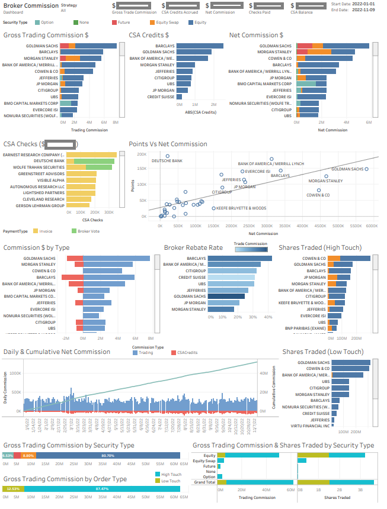
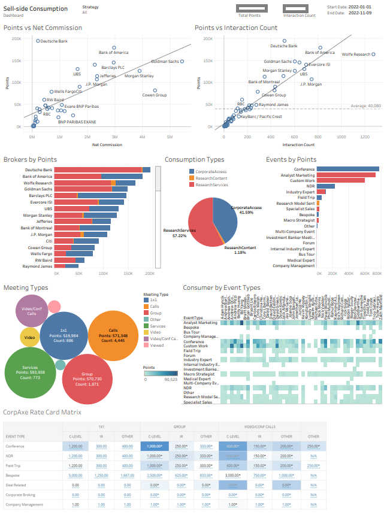
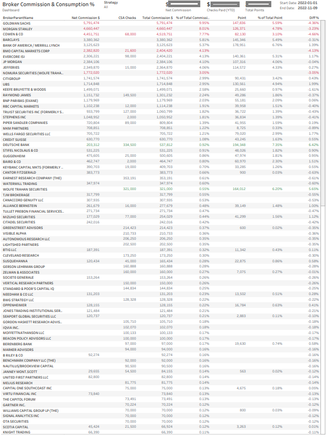

# CorpAxe Broker Commission adn Consumption Tableau Dashboard

- Tableau tabbed dashboard embedded in the WPF window.
- The dashboard presents a comprehensive view of the total gross and net trading commissions, along with CSA credits accumulated for each broker
- It details the volume of shares traded through both high-touch and low-touch methods and provides a breakdown of commission dollars by types of securities, such as equities, options, futures, swaps, and more
- Visualizes the distribution of broker commissions in comparison to CorpAxe points.
- Traders seek to identify the brokers that receive the highest share of commissions.

