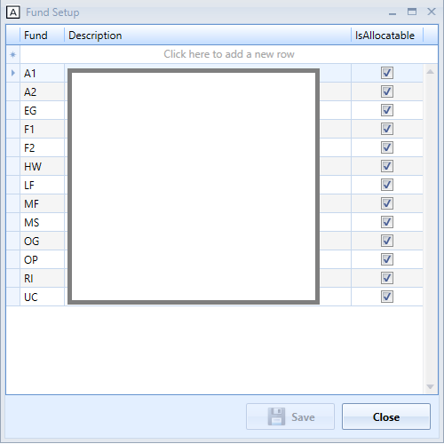
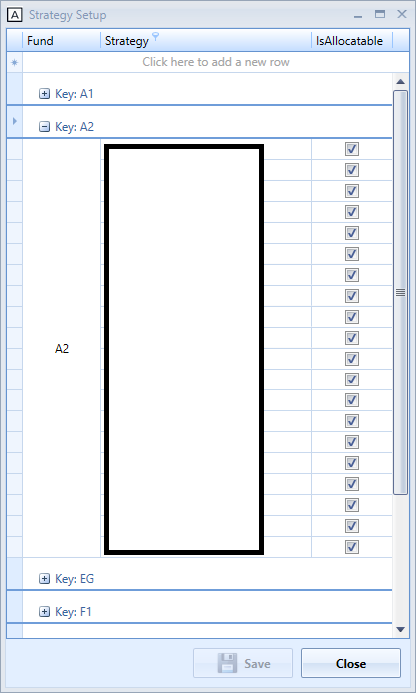

# Asset Allocation Manager

Asset Allocation Manager interface allows administrator to set up (add/remove) new fund and strategy. Administrator can amend asset allocation and equity allocation percentage per strategy per fund. Totals tab shows total asset/equity allocations of funds. It does have breakdown of funds per strategy as well. Individual fund's detail can be accessed via the fund tab.

- Setup window allows adding or removing fund or strategy.
- Update the numbers can be done directly on the grid cell. The cell's background color will turn to pink for any changed numbers.
- User will have an opportunity to confirm prior to saving the changes. The Verify & Save button will pop up another window highlighting all the changes made then user can submit the final changes.
- The Fund Allocation Change by % window allows user to select specific strategies and funds with a number. New percentage will be applied to only selected strategies and funds.
- The Copy Fund to Fund window allows to copy all strategies and allocations from a source fund to a target fund.
- The Change Strategy Allocation window allows change the asset allocations on all funds associated with selected strategies.
- The Copy from Excel window allows user copy and paste funds/strategies allocations directly from the excel spreadsheet.
- When there has been changes submitted, the email notification will be updated - indicating how many changes are there. 
- The Email Notification window allows user to send allocation updates of fund/strategy to predetermined email distribution list.

