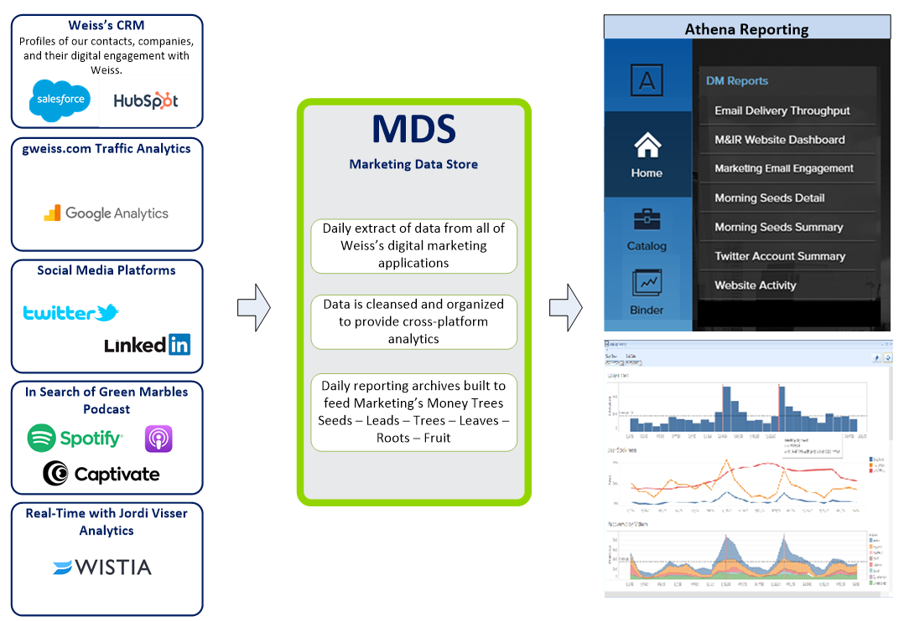
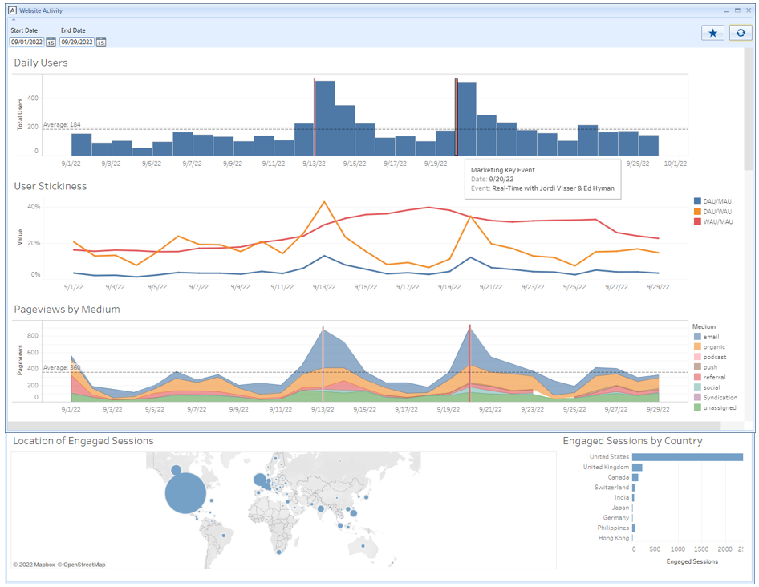
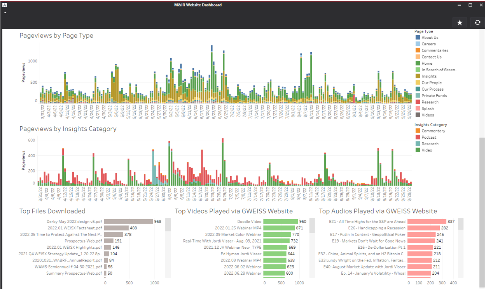
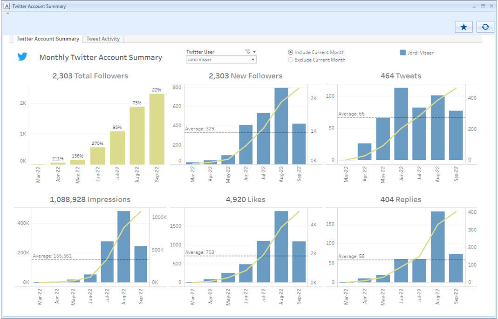

# Digital Marketing Data Warehouse & Analytics

The purpose of this project was to build an on-premise Data Warehouse that regularly pulls data from each of the siloed vendor systems (including Salesforce, HubSpot, Google Analytics, LinkedIn, Twitter, Captivate) into a single reporting structure using common naming and data organization to make reporting easier and more comprehensive.

The build-out of the full end-to-end processes and procedures necessary for the extraction, enrichment, and presentation of the reporting data including:
- Change detection & extraction methods
- Data standardization & normalization methods
- Naming conventions
- Reporting dataset preparation
- Internal audits to confirm data validity
- Technical robustness: e.g. failures/retries

### Marketing Data Store (MDS) & Reporting Workflow

### Website Activities consuming MDS

### Webpage views, Top files download, Top media played consuming MDS

### Twitter account trend consuming MDS

