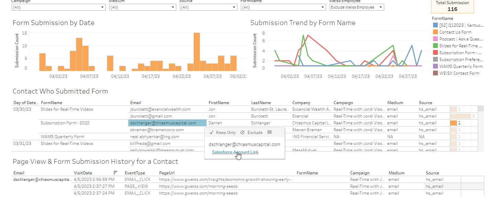

# Hubspot Form Submission Tableau Dashboard

- Tableau dashboard embedded in the WPF window.
- The dashboard scrutinizes the details of individuals who have filled out the forms available in the gweiss website, allowing users to sign up for events like podcasts or webinars by providing their name or email.
- It displays a chronological trend of form submissions categorized by campaign, medium, or source to pinpoint the factors influencing submission numbers.
- The dashboard is capable of filtering contacts to view their submission history It can filter out the contact with submission history and tracking the specific gweiss webpages they have visited in the past.

