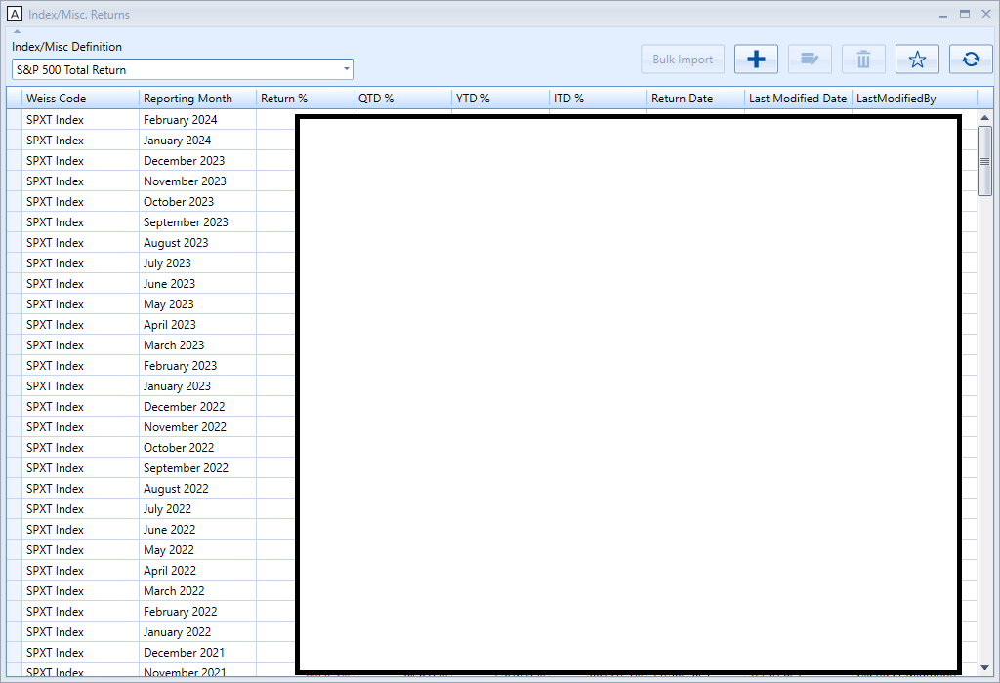
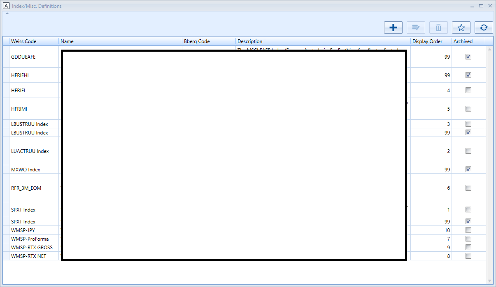

# Monthly Index Return Performance

- Index Definition interface allows admin to add/edit/delete indices that should track the performance.
- After establishing a new index, administrators should utilize the Index/Mis. Return interface to manage the monthly return percentages. The Quarter-to-Date (QTD%), Year-to-Date (YTD%), and Inception-to-Date (ITD%) values will be generated automatically upon entry of the Monthly Return %.
- It is also possible to modify historical Monthly Return % data. Should this occur, all subsequent QTD%, YTD%, and ITD% figures from the amended date onwards will be recalculated automatically to account for the updates.

