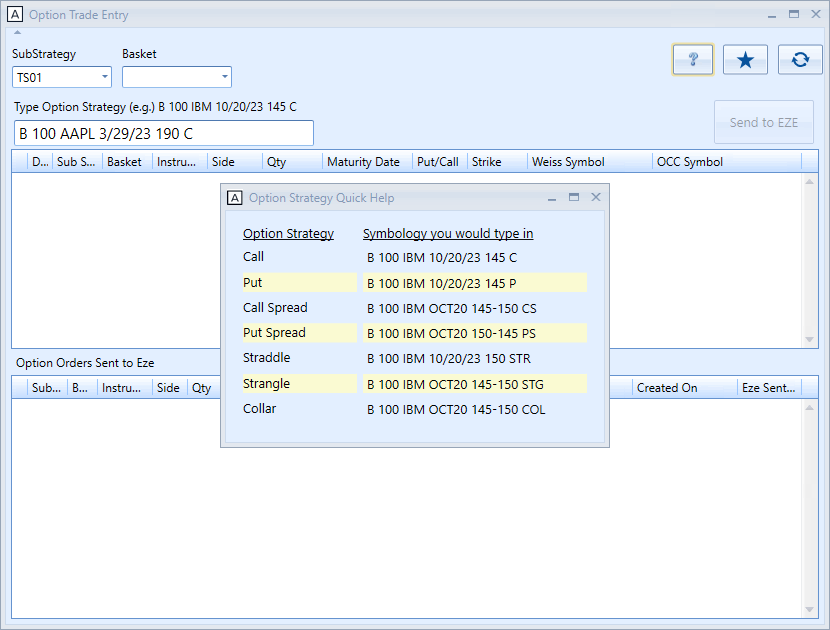

# Option Contract Order/Trade Entry

The Option Contract Entry interface provides a swift method for traders to initiate new option orders. By simply inputting the symbology into the designated field, traders can benefit from the window’s design that emphasizes both flexibility and rapid execution of option orders.

- Strategy dropdown selection will be done automatically by recognizing the logged in trader.
- Option strategy symbology input should consist of six blobs separated by space Examples of option symbology user has to follow are also provided.
- First blob is either B (Buy) or S (Sell). The system automatically figures out if it's new order or unwinding of existing position. For example, Sell IBM option will be initiating a new short option position if there is no current positions.
- Second blob is contract quantity.
- Third blob is symbol.
- Fourth blob is contract expiration date.
- Fifth blob is the contract's price.
- Sixth blob is short-hand form of option strategy.

There are many moving pieces for the option entry to work.
- There are daily jobs that import option contract files from the OCC (https://www.theocc.com/). We couldn't insert every contracts available into our Security Master since there will be too many contracts won't be traded at all and it pollutes the system (talking about millions of contracts).
- Separate data warehouse was set up for option contracts.
- User can create a new option contracts that are validated by the OCC.
- As the symbology was entered in the input box, it will call an internal API which in trun calls the bloomberg API to pull down data like bbergcode, figi, etc.. then inserts it into our Security Master.
- Once the option contract was saved in the Security Master, the 'Send to EZE' button lights up indicating that it's ready for trading. The EZE is third party order management system.
- Pressing 'Send to EZE' button sends the option contracts to the EZE system.
- Audit trail for the option contract trades will be shown at the bottom grid.
