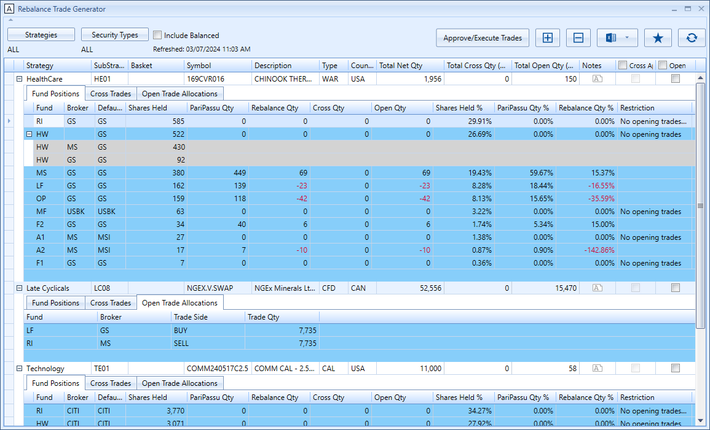
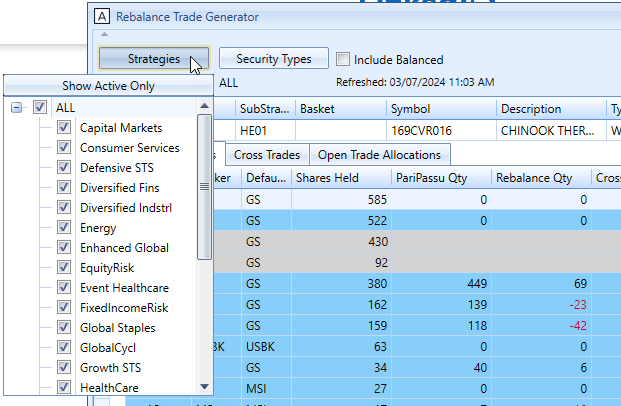

# Rebalance Trade Generator
Portfolio rebalancing tool for PM. Every month PMs need to rebalance their positions according to the latest firm's funds allocation percentage. 
- shows shares amount held by portfolio and fund. Displays details of how much will be rebalanced - crossing and open market quantities.
- handles firm and compliance restrictions as some positions cannot be rebalanced.
- user can pick and choose security types.
- crossing positions among different funds possible. Saves cost for firm since execution is done internally.
- executing rebalancing quantity in open market.

Shows the dropdown list of strategies:
